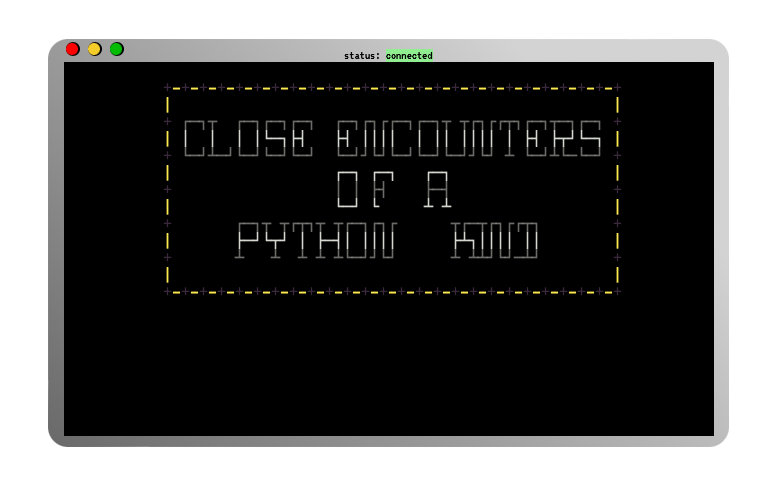

# alienRemix
# Close Encounters of a Python Kind

This repository contains the code for a web site built with Python and using a Flask server. It was originally code from a team project whilt I was on Code Nation's Introduction to Coding course last year, which I have updated to be able to be rendered in a browser. The resulting website can be reached at [https://alien.njtd.xyz](https://alien.njtd.xyz).

# pyxterm.js
To build this website containing a terminal able to run my python code, I first started by looking at [pyxtermjs](https://github.com/cs01/pyxtermjs) - A fully functional terminal in your browser - and adapted it to suit my needs.

## From this...

## To this...
